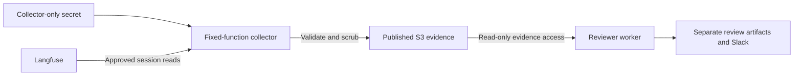

# AE-211: Langfuse access options

**Decision: use direct project-key access for now (option 3).** The operator explicitly accepts the risk that the reviewer process can use its Langfuse credential to write. Sources checked September 29, 2026 (UTC).

Keep the current bounded GET-only collector in the reviewer. Store the existing project's Langfuse credentials in the dedicated monitoring secret; do not grant the reviewer access to the shared system secret. Reusing the project key means revoking it also affects its other consumers. A separately revocable key remains preferable when available, but is not a blocker for this initial deployment.

**TODO: create a way to read-only access LangFuse.** Enforce the restriction outside the reviewer process, and verify that the reviewer cannot obtain an upstream write-capable credential or mutate Langfuse. A separate collector or restricted proxy are future options; neither is required for this deployment.

The comparison below preserves the alternatives for that follow-up. Existing EC2 inspection continues to use the [approved read-only SFTP boundary](../../src/monitoring/OPERATIONS.md#read-only-access-boundary).

**What we are protecting**

The desired boundary is that a compromised reviewer process cannot use its credentials to modify Langfuse. Merely writing code that sends GET requests does not enforce that boundary.

The current reviewer model is tool-free: it receives evidence and returns a structured report. It does not receive API keys or execute HTTP requests itself. A malicious instruction in evidence therefore does not automatically give the model Langfuse access. The concern is the surrounding worker process: vulnerabilities, accidental code changes, or compromise could expose any key that process can read.

The available Langfuse project keys are read/write. Langfuse documents that project keys are scoped to one project and are not tied to a user. Giving a person a Viewer role therefore does not turn their project's API key into a read-only key. [Access controls and API keys](https://langfuse.com/docs/administration/rbac)

**Options at a glance**

| Option | Where the Langfuse key lives | Enforced read-only boundary for the reviewer? | Main benefit | Main cost |
| --- | --- | --- | --- | --- |
| 1. Separate collector → S3 | Collector-only secret | Yes, if IAM separates the collector, evidence, and reviewer | Auditable snapshots; fits scheduled reviews | Another scheduled job and export delay |
| 2. Read-only proxy | Proxy-only secret | Yes, if its API and authentication enforce the restrictions | On-demand, narrowly scoped reads | Another service and request-validation surface |
| 3. Direct dedicated key | Reviewer-accessible secret | No | Smallest implementation change | Reviewer process retains write capability |
| 4. Native Langfuse → S3 export | Managed Langfuse integration | Yes, with suitable S3 permissions and publication controls | Avoids building the Langfuse fetcher | Plan eligibility, export delay, and broad export scope |
| 5. Keep SFTP-only monitoring | No Langfuse key in reviewer | Yes for the existing host export access | No new integration | Missing direct model/tool trace evidence |

“Enforced” is conditional on the stated isolation being implemented and tested. A collector or proxy still holds a write-capable upstream key; the design moves that authority into a smaller trusted component rather than eliminating it.

**1. Separate collector → S3 — future isolation option**

The collector runs independently of model inference. It reads an operator-controlled target/session registry, fetches bounded windows, validates the returned session identities, and publishes sanitized, versioned evidence with a manifest. The reviewer reads those snapshots and continues writing its own reports separately.

**Pros:** the reviewer never receives the upstream key; model retries can reuse the same evidence; versioned snapshots make reviews reproducible; collection and inference failures can be diagnosed independently. A small scheduled function or job should be enough; this does not require a general-purpose data platform.

**Cons:** another component needs deployment, monitoring, retries, and ownership. Snapshots add storage and latency. The collector can still mutate Langfuse if it is compromised because its key remains read/write. It also processes potentially sensitive trace content before publication.

The separation must be real: a distinct IAM role and secret, no reviewer access to that secret or role, and no reviewer ability to rewrite the collector's code, approved registry, or published evidence. Evidence should live under a prefix or bucket the reviewer can read but cannot write; its existing report-writing permissions must not overlap. The collector must not accept arbitrary URLs, queries, or session IDs supplied by model output.

This requires a new collector, Terraform/IAM configuration, an S3 evidence reader in the worker, and failure/freshness checks. It is the best fit when periodic review and durable evidence matter more than arbitrary on-demand queries.

**2. Read-only proxy**

The reviewer authenticates to a small service using its AWS identity or another narrowly scoped credential. The proxy holds the Langfuse key and exposes an operation such as “read approved observations for this target and time window.”

**Pros:** fetches evidence on demand without handing over the key; centralizes authorization and request limits; avoids waiting for a separate export schedule. This becomes attractive if several clients need controlled interactive trace access.

**Cons:** every read depends on another service's availability. Authentication, query validation, pagination, rate limits, and error handling become our responsibility. A generic HTTP forwarding proxy is easy to configure too broadly. The proxy itself still has a write-capable key.

Allow only the exact upstream read endpoints required, with a fixed upstream host. Derive permitted sessions from trusted configuration and bound timestamps, fields, page count, and response size. Reject arbitrary paths, redirects, method overrides, and extra query parameters. In particular, Langfuse documents that its advanced `filter` parameter overrides fixed filters; blindly forwarding it could bypass an enforced session or time restriction. [Observations API contract](https://langfuse.com/docs/api-and-data-platform/features/public-api)

This requires a new authenticated service and changes to the worker's Langfuse authentication/preflight path. It offers more flexibility than the collector, which is also why it has more access-control cases to test.

**3. Direct read/write key, with GET-only worker code — selected**

Put the project key in the dedicated monitoring secret. The existing collector code already makes bounded GET requests. A separately revocable monitoring key is preferable; the initial deployment reuses the existing project key to keep setup simple.

**Pros:** fastest path to direct trace coverage; smallest implementation change; no additional service. A dedicated key can be revoked without disrupting the workload's tracing key.

**Cons:** it does not satisfy an enforced read-only requirement for the worker. AWS IAM can limit which secret the worker reads, but it cannot restrict how that key is used at Langfuse. A dedicated key within the same project does not reduce its project data permissions. The tool-free model design reduces one route to misuse but does not remove the worker's authority.

This is a reasonable explicit risk acceptance for an isolated pilot if implementation simplicity matters more than strict separation. It should be described as **read-only behavior using a write-capable credential**, never as read-only access.

**4. Langfuse's native S3 export**

Langfuse can publish scheduled exports to blob storage. The documented intervals are every 20 minutes, hourly, daily, or weekly. Cloud availability is listed for Pro with the Teams add-on and Enterprise; self-hosted availability is also documented. Account eligibility has not been established here. [Native export documentation](https://langfuse.com/docs/api-and-data-platform/features/export-to-blob-storage)

**Pros:** avoids maintaining our own API poller and keeps Langfuse API credentials out of the reviewer. S3 IAM can enforce read-only consumption.

**Cons:** the shortest interval is slower than our five-minute review schedule. Exported content may be broader than the approved sessions/fields and may include sensitive inputs or outputs. We would still need to inspect the export schema and filtering capabilities, adapt the worker, and potentially add a scrub-and-publish step before reviewer access. Subscription requirements may add cost.

Prefer this over a custom collector if the account already supports it, the delay is acceptable, and its export scope can be made suitable. An S3 destination alone does not make raw traces safe to disclose to the reviewer model.

**5. Keep SFTP-only monitoring for now**

Continue reading approved host exports through the existing forced read-only SFTP account. Keep direct Langfuse access unconfigured and report the missing trace coverage.

**Pros:** the boundary is already implemented and tested; no new credentials or services; useful for independently checked artifacts and approved operational summaries.

**Cons:** curated summaries do not replace actual prompt, generation, and tool-call records. They cannot establish that unreported actions did not occur, and snapshots can become stale. This is an honest limited-coverage baseline, not equivalent trace monitoring.

**Additional isolation: a separate Langfuse project**

A dedicated project can reduce the data exposed if a key leaks. It can supplement options 1–3, but the key still has write capability within that project. Moving live workloads to a new project requires changing their tracing configuration and may complicate historical correlation; those changes are outside the currently approved scope for existing machines. Project isolation also does not create independent evidence if the monitored workload can itself alter that project's data. [Project key scope](https://langfuse.com/docs/administration/rbac)

**Latency, cost, and evidence quality**

A five-minute polling schedule is not a five-minute detection guarantee. End-of-turn tracing, Langfuse ingestion delay, collection, Batch startup, and inference all contribute. Langfuse currently documents possible delays of up to 15 minutes on v2 reads for older SDKs/exporters without the newer ingestion header. A proxy cannot retrieve evidence that has not arrived. [Data availability](https://langfuse.com/docs/api-and-data-platform/features/public-api)

Relative effort is clearer than an unsupported dollar estimate: direct access and SFTP-only add the least infrastructure; a collector adds requests and evidence storage; a proxy adds per-request service operation; native export may add subscription cost. Actual cost depends on session volume, payload size, retention, polling overlap, and the current Langfuse plan. Inference remains separately budgeted.

None of these choices proves the source traces are complete or untampered. Preserve provenance and collection timestamps, distinguish missing data from a clean review, and keep independent host evidence where available. Secret-pattern matching alone is not sufficient approval to send arbitrary trace content to another model provider.

**What would change the recommendation?**

Choose the proxy if interactive, on-demand reads become a concrete requirement. Choose native export if it is already available and a 20-minute export interval is acceptable. Choose direct access only with explicit acceptance of the worker's write-capable credential. Keep SFTP-only if trace integration is not yet worth the additional trusted component.

For the recommended collector, the minimum acceptance evidence is: the reviewer cannot retrieve the Langfuse secret, impersonate the collector, expand approved sessions, or overwrite source evidence; unauthorized sessions are rejected; sensitive test fixtures are withheld or scrubbed before publication; late arrivals and overlapping windows are handled; stale or failed collection produces a coverage gap; and a live review links back to the exact published evidence version.

**Recorded decision:** option 3, with explicit acceptance of write-capable credentials in the reviewer process. Keep collection bounded to operator-approved sessions and content. Read-only enforcement remains a TODO; choosing direct access does not broaden host access or authorize the monitoring code to issue Langfuse writes.
