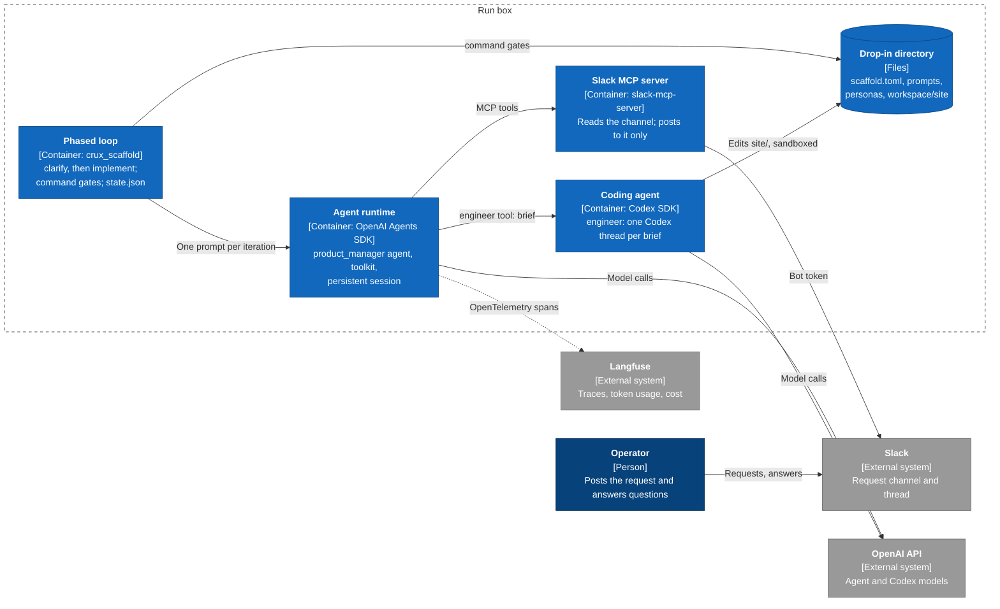

# `sdk-scaffold/` — a CRUX scaffold built on agent SDKs

`crux_scaffold` runs a CRUX from a **drop-in directory**. Everything about the run is declared in the drop-in's `scaffold.toml`: which agents exist and what each may call, how the outer loop decides a phase is done, how context is managed, and the token budget. The scaffold assembles that declaration from registered components. It runs agents on the OpenAI Agents SDK and delegates coding to Codex ([AE-230](https://linear.app/agent-evals/issue/AE-230/prototype-custom-scaffold-using-agent-sdks)).

## Terminology

These terms follow `ciab-design-docs` (*CRUX Scaffold Philosophy* and *CRUX Scaffold Design*).

| Term | Meaning |
|---|---|
| **CRUX** | An experiment that evaluates AI agents on a real-world task. |
| **Scaffold** | The infrastructure around the LLMs: tools, prompts, loops. Claude Code, Codex, OpenClaw and this package are all scaffolds. The team docs also say *harness*; this package avoids that word. |
| **Drop-in directory** | A CRUX's input to a scaffold: `scaffold.toml`, prompts, personas, standing context, extensions and the workspace. On a run box it is staged at `/srv/crux-run/run-harness`. |
| **Workspace** | The directory the agents work in, inside the drop-in directory. |
| **Agent runtime** | The agent SDK that runs the declared agents: OpenAI Agents SDK now, Claude Agent SDK later. |
| **Agent**, **orchestrator** | An LLM agent declared with a persona, standing context and tools. The orchestrator is the agent that receives the loop's prompts. |
| **Coding agent** | A non-interactive coding-agent SDK session (Codex now, Claude Code later) that agents delegate implementation to. It keeps its own proprietary scaffold. |
| **Delegate** | An agent or coding agent that another agent calls as a tool. It starts from a fresh context holding only the caller's brief. |
| **Persona**, **standing context** | Who an agent is (`personas/*.md`); what it must know for the whole run (the files in its `context`). |
| **Toolkit**, **tool** | The functions agents can call: built-ins plus a drop-in's extensions. |
| **Loop**, **phase**, **iteration** | The outer loop runs phases in order. Each phase repeats iterations, one prompt to the orchestrator each, until its gates pass. |
| **Gate** | A check the loop runs between iterations (the team's *gating criteria*): a deterministic verifier, or a judgment by an isolated model the agents cannot author. A failing gate produces the next prompt. |
| **Context strategy** | How an agent's conversation is stored, and what part of it reaches the model on each call. |
| **Budget** | Hard token limits the loop enforces between iterations. |
| **Steering channel** | How the operator and the agents reach each other. The demo uses Slack through MCP. |
| **Operator** | The human running the CRUX. |
| **Run box** | The EC2 instance a run executes on; `src/ec2-workspaces/` calls it a *workspace*. |

## Design

Each scaffold responsibility in the team's design has one interface. Built-in implementations register themselves under a type name; a drop-in adds its own through `extensions`. This first version ships one implementation of each interface, the ones the demo needs.

| Responsibility | Interface (registry) | Built-in types |
|---|---|---|
| Agent orchestration, model configuration | `AgentRuntime` (`RUNTIMES`) | `openai-agents` |
| Agent loop: phases and gating criteria | `Loop` (`LOOPS`), `Gate` (`GATES`) | `phased`; `command` |
| Context management | `ContextStrategy` (`CONTEXT_STRATEGIES`) | `persistent` |
| Toolkit | `Tool` (`TOOLS`) | `read_file`, `write_file`, `list_files`, `command`, `rest`, `budget_status` |
| Coding subagents | `CodingAgent` (`CODING_AGENTS`) | `codex` |
| Communication (steering) | MCP servers in `[mcp_servers]` | any stdio MCP server; the demo uses Slack |
| Observability | `Telemetry` | Langfuse, or off |
| Resource management | `Budget`, `budget_status` | token limits |

`scaffold.py` is the composition root: it is the only place components are built and wired together. `config.py`, `drop_in.py`, `loop.py`, `gates.py` and `tools.py` never import an agent SDK. The OpenAI Agents SDK is confined to `runtimes/openai_agents.py` and `context_strategies.py`, and Codex to `coding_agents.py`.

The product-change demo in this design, as a C4 container view:



## A drop-in directory

```
scaffold.toml            the declaration (see examples/product-change/scaffold.toml)
PROMPT.md                first phase's prompt, sent verbatim
prompts/*.md             later phase prompts and continue prompts
personas/*.md            one per agent
scaffold_extensions.py   optional: the drop-in's own components
workspace/               where agents work; AGENTS.md and other standing context live here
OPERATOR_GUIDE.md        how to resolve placeholders and launch; operator notes live only here
```

The run stops before any model call if an operator-facing file or standing-context file still contains a `{{KEY}}` or `{{KEY|default}}` placeholder. The error lists each one as `file:line`.

## Extending

Implement the interface, register the class, and list the module in `extensions`. The class's `Options` model is its declarative configuration. For example, the demo's tool:

```python
@TOOLS.register
class SitePreview(Tool):
    type_name = "site_preview"
    description = "Build the site and return one page's HTML."
    Arguments = PreviewArguments

    async def invoke(self, ctx: RunContext, args: PreviewArguments) -> str: ...
```

```toml
extensions = ["scaffold_extensions.py"]

[agents.product_manager]
tools = ["read_file", "site_preview"]
```

Gates, context strategies, coding agents, loops and runtimes extend the same way. [docs/extending.md](docs/extending.md) describes each extension point's contract, and when to extend one rather than add a new abstraction.

## Commands

```bash
python -m crux_scaffold check --drop-in DIR    # validate and print the assembly; no model calls
python -m crux_scaffold run --drop-in DIR      # run the loop; resumes from DIR/.state after a restart
python -m crux_scaffold probe [--coding-agent codex]   # one traced model call (plus one Codex turn)
```

`check` and `probe` are the first two of the team's testing protocols: nothing in the environment is broken, and the agent can do anything at all. Exit codes:

- 0: the loop completed.
- 1: a probe failed.
- 2: a configuration error.
- 3: the loop stopped early because its iterations or budget ran out.
- 128 + the signal number: the run was stopped by SIGTERM or SIGINT. The unfinished iteration reruns on restart.

## Tracing

Langfuse v4 never updates an observation once it has stored it, so each observation is sent exactly once, when it ends. The scaffold keeps what it sends short-lived so that a long run stays visible while it progresses. These rules follow the AE-240 findings for the Codex boxes:

- **One trace per loop iteration.** Traces are named like `clarify #1` and grouped by the run's session (`RUN_SLUG`). A trace's root arrives when its iteration ends; its children arrive as they finish.
- **Coding-agent turns stream.** A Codex turn is one `generation` observation. Each Codex item, such as a command, file change or message, is sent as a child the moment it completes. The generation itself arrives at the end of the turn with the output and token usage. Usage is split into Langfuse's exclusive buckets (uncached input, cache reads, cache writes, output, reasoning), so each token is priced once, at its own rate.
- **Generations stay small.** Langfuse reads an Agents SDK generation's input and output from `input.value` and `output.value`, so the SDK's per-message attributes (`llm.input_messages.*`) are not recorded. They grow with the conversation, and past OpenTelemetry's 128-attribute limit they would evict the span's session, tags, model and usage.
- **A stopped scaffold flushes.** SIGTERM or SIGINT ends every open observation with level `WARNING` and a `stopped` status message before the process exits. A SIGKILL, such as from the OOM killer, still loses the open iteration's root and anything not yet flushed. Langfuse's flush interval is 5 seconds.

## Environment

| Variable | Use |
|---|---|
| `OPENAI_API_KEY` | Agent and Codex model calls |
| `CRUX_MODEL`, `CRUX_REASONING_EFFORT` | The default model and effort for agents and coding agents. Overridden by `[runtime]` or by an agent's or coding agent's own settings. A run with no model for some agent or coding agent stops with a configuration error. |
| `LANGFUSE_PUBLIC_KEY`, `LANGFUSE_SECRET_KEY`, `LANGFUSE_BASE_URL` | Tracing. When unset, tracing is off; `probe` requires it. |
| `RUN_SLUG`, `CRUX_WORKSPACE_ID` | The trace environment (the slug, lowercased), session, tags and metadata. These match the Codex and Claude boxes. |
| Variables that `[mcp_servers]` reference | For example `SLACK_BOT_TOKEN`. An MCP server receives only its declared `env` and a minimal `PATH`/`HOME` environment. |

## Run the demo in Docker

`docker/demo.sh` builds an image holding the scaffold, the demo drop-in and the Slack MCP server, then runs it. The container stages the drop-in once in the volume `crux-sdk-scaffold-demo` at `/work/product-change`, so a rerun resumes the run there.

1. **Slack.** Create the app from [`examples/product-change/slack-app-manifest.yaml`](examples/product-change/slack-app-manifest.yaml), then install it, invite the bot to a channel and copy the channel ID. See the demo's [OPERATOR_GUIDE.md](examples/product-change/OPERATOR_GUIDE.md), section 1.
2. **Secrets.** Export them in the shell that runs `demo.sh`. `read -rs` keeps them off the screen and out of shell history:

   ```bash
   for name in OPENAI_API_KEY SLACK_BOT_TOKEN LANGFUSE_PUBLIC_KEY LANGFUSE_SECRET_KEY; do
     printf '%s: ' "$name"; read -rs "$name"; export "$name"; echo
   done
   export LANGFUSE_BASE_URL=https://us.cloud.langfuse.com CRUX_MODEL=<model> CRUX_REASONING_EFFORT=medium
   export RUN_SLUG=local-<you> SLACK_CHANNEL_ID=C…
   ```

   The Langfuse keys are the CRUX project's, the same ones stored in SSM `/crux/system/env`. `demo.sh` passes each variable to the container by name (`--env NAME`), so no value appears on a command line.
3. **Run.**

   ```bash
   cd src/sdk-scaffold
   docker/demo.sh probe   # one traced model call and one Codex turn
   docker/demo.sh check   # stage the drop-in and print its assembly; no model calls
   docker/demo.sh run
   ```

   Before `run`, post the request in the channel as yourself, as a top-level message: *"Can events show where they're happening?"* Then answer the agent's question in the thread. The demo's OPERATOR_GUIDE.md, sections 3 and 4, describes the run and what success looks like.
4. **Inspect, stop, reset.**
   - `docker/demo.sh bash` opens a shell in the volume. `REQUEST.md`, `LOG.md` and `site/` are in `/work/product-change/workspace`, and the loop state is in `/work/product-change/.state`.
   - Ctrl-C or `docker stop` ends the run cleanly (exit 130 or 143). `docker/demo.sh run` resumes it.
   - `docker/demo.sh reset` deletes the volume so the next run starts fresh.

Inside the container, Codex runs with `sandbox = "full-access"` because its Linux sandbox (bubblewrap) cannot create namespaces in an unprivileged container. The container is the boundary instead: it runs as a non-root user, and the volume at `/work` is its only persistent storage. A run box keeps `workspace-write`.

## Development

```bash
cd src/sdk-scaffold
uv venv .venv --python 3.12
uv pip install --python .venv/bin/python -r requirements.txt 'pytest>=8,<9' ruff==0.14.0
.venv/bin/ruff check . && .venv/bin/python -m pytest -q
```

Contribution guidelines are in [AGENTS.md](AGENTS.md). Tests never call a model or the network. They use scripted models, a scripted coding agent, a fake runtime, a fake stdio Slack MCP server and an in-memory span exporter.
