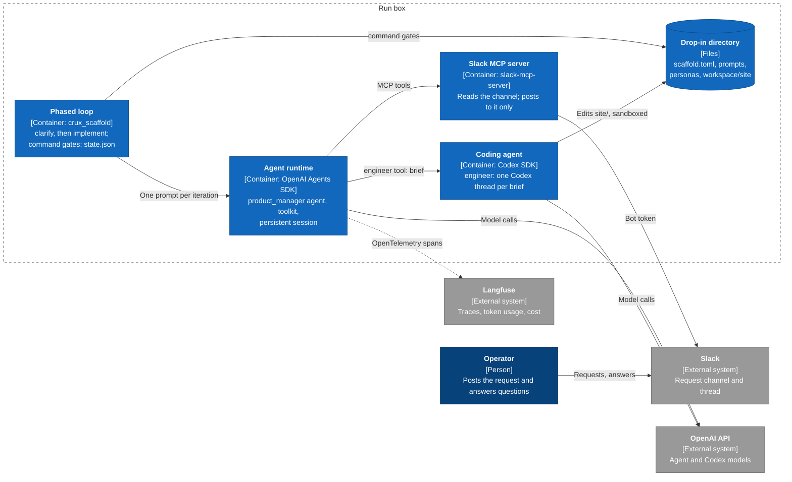

# `sdk-scaffold/` — a CRUX scaffold built on agent SDKs

`crux_scaffold` runs a CRUX from a **drop-in directory**. Everything about the run is declared in the drop-in's `scaffold.toml`: which agents exist and what each may call, how the outer loop decides a phase is done, how context is managed, and the token budget. The scaffold assembles that declaration from registered components. It runs agents on the OpenAI Agents SDK and delegates coding to Codex ([AE-230](https://linear.app/agent-evals/issue/AE-230/prototype-custom-scaffold-using-agent-sdks)).

## Terminology

These terms follow `ciab-design-docs` (*CRUX Scaffold Philosophy* and *CRUX Scaffold Design*).

| Term | Meaning |
|---|---|
| **CRUX** | An experiment that evaluates AI agents on a real-world task. |
| **Scaffold** | The infrastructure around the LLMs: tools, prompts, loops. Claude Code, Codex, OpenClaw and this package are all scaffolds. The team docs also say *harness*; this package avoids that word. |
| **Drop-in directory** | A CRUX's input to a scaffold: `scaffold.toml`, prompts, personas, standing context, extensions and the workspace. On a run box it is staged at `/srv/crux-run/run-harness`. |
| **Workspace** | The directory the agents work in, inside the drop-in directory. |
| **Agent runtime** | The agent SDK that runs the declared agents: OpenAI Agents SDK now, Claude Agent SDK later. |
| **Agent**, **orchestrator** | An LLM agent declared with a persona, standing context and tools. The orchestrator is the agent that receives the loop's prompts. |
| **Coding agent** | A non-interactive coding-agent SDK session (Codex now, Claude Code later) that agents delegate implementation to. It keeps its own proprietary scaffold. |
| **Delegate** | An agent or coding agent that another agent calls as a tool. It starts from a fresh context holding only the caller's brief. |
| **Persona**, **standing context** | Who an agent is (`personas/*.md`); what it must know for the whole run (the files in its `context`). |
| **Toolkit**, **tool** | The functions agents can call: built-ins plus a drop-in's extensions. |
| **Loop**, **phase**, **iteration** | The outer loop runs phases in order. Each phase repeats iterations, one prompt to the orchestrator each, until its gates pass. |
| **Gate** | A check the loop runs between iterations (the team's *gating criteria*): a deterministic verifier, or a judgment by an isolated model the agents cannot author. A failing gate produces the next prompt. |
| **Context strategy** | How an agent's conversation is stored, and what part of it reaches the model on each call. |
| **Budget** | Hard token limits the loop enforces between iterations. |
| **Steering channel** | How the operator and the agents reach each other. The demo uses Slack through MCP. |
| **Operator** | The human running the CRUX. |
| **Run box** | The EC2 instance a run executes on; `src/ec2-workspaces/` calls it a *workspace*. |

## Design

Each scaffold responsibility in the team's design has one interface. Built-in implementations register themselves under a type name; a drop-in adds its own through `extensions`. The demo uses one implementation of each interface; the others show how a CRUX with different needs swaps them in (see [Adapting the demo](#adapting-the-demo)).

| Responsibility | Interface (registry) | Built-in types |
|---|---|---|
| Agent orchestration, model configuration | `AgentRuntime` (`RUNTIMES`) | `openai-agents` |
| Agent loop: phases and gating criteria | `Loop` (`LOOPS`), `Gate` (`GATES`) | `phased`; `command`, `llm_judge` |
| Context management | `ContextStrategy` (`CONTEXT_STRATEGIES`) | `persistent`, `trim_recent`, `openai_compaction` |
| Toolkit | `Tool` (`TOOLS`) | `read_file`, `write_file`, `list_files`, `run_shell`, `command`, `rest`, `budget_status` |
| Coding subagents | `CodingAgent` (`CODING_AGENTS`) | `codex` |
| Communication (steering) | MCP servers in `[mcp_servers]` | any stdio MCP server; the demo uses Slack |
| Observability | `Telemetry` | Langfuse, or off |
| Resource management | `Budget`, `budget_status` | token limits |

`scaffold.py` is the composition root: it is the only place components are built and wired together. `config.py`, `drop_in.py`, `loop.py`, `gates.py` and `tools.py` never import an agent SDK. The OpenAI Agents SDK is confined to `runtimes/openai_agents.py` and `context_strategies.py`, and Codex to `coding_agents.py`.

The product-change demo in this design, as a C4 container view:



## A drop-in directory

```
scaffold.toml            the declaration (see examples/product-change/scaffold.toml)
PROMPT.md                first phase's prompt; text above its first `---` line is operator notes
prompts/*.md             later phase prompts, continue prompts, judge rubrics
personas/*.md            one per agent
scaffold_extensions.py   optional: the drop-in's own components
workspace/               where agents work; AGENTS.md and other standing context live here
OPERATOR_GUIDE.md        how to resolve placeholders and launch
```

The run stops before any model call if an operator-facing file or standing-context file still contains a `{{KEY}}` or `{{KEY|default}}` placeholder. The error lists each one as `file:line`.

## Extending

Implement the interface, register the class, and list the module in `extensions`. The class's `Options` model is its declarative configuration. For example, the demo's tool:

```python
@TOOLS.register
class SitePreview(Tool):
    type_name = "site_preview"
    description = "Build the site and return one page's HTML."
    Arguments = PreviewArguments

    async def invoke(self, ctx: RunContext, args: PreviewArguments) -> str: ...
```

```toml
extensions = ["scaffold_extensions.py"]

[agents.product_manager]
tools = ["read_file", "site_preview"]
```

Gates, context strategies, coding agents, loops and runtimes extend the same way.

## Adapting the demo

A CRUX with different needs changes declarations, not code. The same drop-in could, for example:

- **Judge the outcome, not just the tests.** Add an isolated `llm_judge` gate to the `implement` phase. The judge sees only its rubric, the orchestrator's final output, and the workspace files listed in `inspect`. It can write the next prompt itself.
  ```toml
  [[loop.phases]]
  name = "implement"
  gates = ["site_tests_pass", "request_met"]

  [gates.request_met]
  type = "llm_judge"
  rubric = "prompts/judge_request.md"
  inspect = ["REQUEST.md", "site/sitegen.py", "site/test_sitegen.py"]
  ```
- **Bound the context of a long run.** Send only recent history, cut at a user message so tool calls keep their results. The full history stays in the session.
  ```toml
  [context]
  type = "trim_recent"
  max_items = 300
  ```
  Or let the Responses API summarize older history once it grows:
  ```toml
  [context]
  type = "openai_compaction"
  trigger_items = 200
  ```
- **Let an agent run arbitrary commands** in the workspace, with a declared timeout:
  ```toml
  [tools.run_shell]
  timeout_seconds = 300
  ```
- **Add something no built-in covers:** a CRUX-specific algorithm, a new gate or a new coding agent. Subclass the interface and register it in the drop-in's extension module, as the demo does for `site_preview`.

## Commands

```bash
python -m crux_scaffold check --drop-in DIR    # validate and print the assembly; no model calls
python -m crux_scaffold run --drop-in DIR      # run the loop; resumes from DIR/.state after a restart
python -m crux_scaffold probe [--coding-agent codex]   # one traced model call (plus one Codex turn)
```

`check` and `probe` are the first two of the team's testing protocols: nothing in the environment is broken, and the agent can do anything at all. Exit codes are 0 when the loop completes, 1 when a probe fails, 2 for a configuration error and 3 when the loop stops early (iterations or budget exhausted).

## Environment

| Variable | Use |
|---|---|
| `OPENAI_API_KEY` | Agent, judge and Codex model calls |
| `CRUX_MODEL`, `CRUX_REASONING_EFFORT` | The default model and effort. Overridden by `[runtime]` or by an agent's own settings. |
| `LANGFUSE_PUBLIC_KEY`, `LANGFUSE_SECRET_KEY`, `LANGFUSE_BASE_URL` | Tracing. When unset, tracing is off; `probe` requires it. |
| `RUN_SLUG`, `CRUX_WORKSPACE_ID` | The trace environment (the slug, lowercased), session, tags and metadata. These match the Codex and Claude boxes. |
| Variables that `[mcp_servers]` reference | For example `SLACK_BOT_TOKEN`. An MCP server receives only its declared `env` and a minimal `PATH`/`HOME` environment. |

## On a run box

Set `AGENT_PLATFORM=openai-agents` and `DROP_IN_PATH=<drop-in directory>` in the workspace base config; see [`../ec2-workspaces/README.md`](../ec2-workspaces/README.md). Provisioning does four things, and creates no AgentRQ workspace:

1. It stages this directory, root-owned, at `/opt/crux-sdk-scaffold`, and the drop-in at `/srv/crux-run/run-harness`.
2. It writes the environment above to `/etc/crux-run.env`.
3. It runs `probe --coding-agent codex`.
4. It installs `crux-sdk-run.service`, but does not start it.

## Development

```bash
cd src/sdk-scaffold
uv venv .venv --python 3.12
uv pip install --python .venv/bin/python -r requirements.txt 'pytest>=8,<9' ruff==0.14.0
.venv/bin/ruff check . && .venv/bin/python -m pytest -q
```

Tests never call a model or the network. They use scripted models, a scripted coding agent, a fake runtime, a fake stdio Slack MCP server and an in-memory span exporter.
